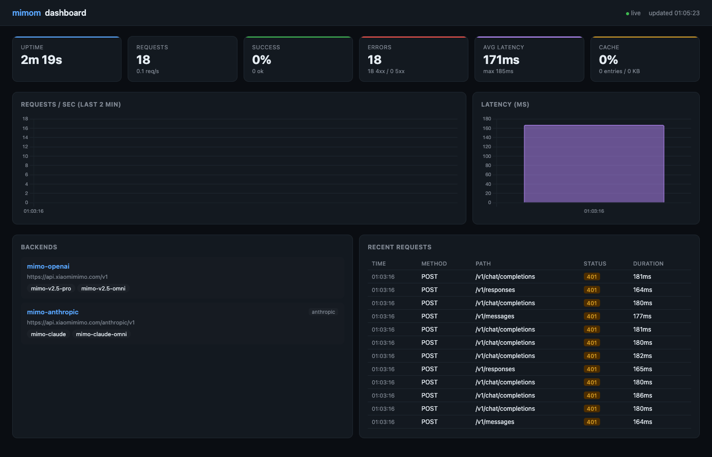

# MiMom

> 多协议推理链缓存代理 — 让 XiaoMi MiMo 的 reasoning_content 在多轮会话中不再断裂
>
> Multi-protocol reasoning cache proxy for XiaoMi MiMo | OpenAI · Anthropic · Codex CLI
>

推理模型在多轮会话中要求历史 `reasoning_content` 完整回传，否则返回 **400 Bad Request**。但大多数 SDK 客户端会自动丢弃这些非标准字段。

**MiMom** 位于客户端与上游之间，自动缓存推理链（reasoning/thinking），在下一轮请求中注入回对应消息。支持三种协议入口，按后端类型自动选择对应协议。

## 演示



---

## 核心特性

### 多协议支持

三条路由，按后端类型自动选择协议：

|路由|输入协议|处理方式|
|---|---|---|
|`/v1/chat/completions`|Chat Completions|直通透传到 OpenAI 兼容后端|
|`/v1/responses`|Responses API|翻译为 Chat Completions（Codex CLI 兼容）|
|`/v1/messages`|Anthropic Messages|直通透传到 Anthropic 后端|

### 推理链缓存

```text
查询 → 内存 LRU 命中 → 注入 reasoning → 转发
       ↓ miss
     填充空 reasoning → tool_calls 完整保留 → 转发
```

- **LRU 热缓存**：微秒级访问，自动淘汰冷数据
- **TTL 过期**：每条缓存 3 小时后自动清理
- **内存上限**：总缓存 64MB，超出时淘汰最久未使用条目
- **双格式支持**：OpenAI `reasoning_content` 字段 + Anthropic `thinking` content block

### 模型路由

每个后端声明它服务的模型名。请求按 `model` 字段精确匹配，未命中回退到默认后端。一个代理同时服务 MiMo、DeepSeek、Claude。

### 错误透传

上游返回 4xx/5xx 时，代理原样透传原始状态码给下游，不做内部重试。客户端按自己的策略正常重连。

### Dashboard

深色主题 Web 面板，启动后访问 `http://localhost:12580/dashboard`：

- **运行统计**：请求数、成功率、RPS、错误数、流式数、缓存命中率
- **实时图表**：请求/秒折线图（2 分钟）、延迟柱状图
- **后端状态**：已配置的后端列表、模型映射
- **请求日志**：最近 100 条请求（方法、路径、状态码、耗时）
- **自动刷新**：5 秒轮询

---

## 工作原理

```text
                    首次请求                         后续请求
客户端 ─── req (无 reasoning) ──→  代理  ──→  上游
                                          ↑
                                    缓存 reasoning ←─── 响应

客户端 ─── req (无 reasoning) ──→  代理  ──→  req (注入 reasoning) ──→ 上游
                                     ↑
                              从缓存取出 reasoning
```

|场景|行为|
|---|---|
|**有缓存**|注入 `reasoning_content`（OpenAI）/ `thinking` block（Anthropic）到 assistant 消息|
|**无缓存**|填充空 reasoning 字段，保留 `tool_calls` / `tool_use` 完整，协议不断裂|

---

## 快速开始

### 1. 构建

```bash
go build -o mimom ./cmd/mimom/
```

### 2. 配置

```bash
cp config.yaml config.local.yaml
# 编辑 config.local.yaml，填入 API Key
```

### 3. 启动

```bash
./mimom -config config.local.yaml
```

```text
MiMom 0.1.0 — MiMo API Proxy

config: loaded 2 backend(s)
  [mimo-openai] https://token-plan-cn.xiaomimimo.com/v1 → [mimo-v2.5-pro mimo-v2.5-omni]
  [mimo-anthropic] https://token-plan-cn.xiaomimimo.com/anthropic/v1 → [mimo-claude mimo-claude-omni]
auth: disabled (open access)
listening on :12580
```

---

## 使用说明

### 作为 OpenAI 代理

将 mimom 作为 OpenAI API 的透明代理，支持流式和非流式请求：

```bash
# 设置环境变量，让 OpenAI SDK 指向 mimom
export OPENAI_BASE_URL=http://localhost:12580/v1
export OPENAI_API_KEY=sk-xxx

# 直接用 curl 测试
curl http://localhost:12580/v1/chat/completions \
  -H "Content-Type: application/json" \
  -H "Authorization: Bearer sk-xxx" \
  -d '{"model":"mimo-v2.5-pro","messages":[{"role":"user","content":"你好"}]}'
```

Python SDK 用法：

```python
from openai import OpenAI

client = OpenAI(base_url="http://localhost:12580/v1", api_key="sk-xxx")
resp = client.chat.completions.create(
    model="mimo-v2.5-pro",
    messages=[{"role": "user", "content": "你好"}]
)
print(resp.choices[0].message.content)
```

### 作为 Anthropic 代理

对接 Claude Code 等使用 Anthropic Messages API 的客户端：

```bash
export ANTHROPIC_BASE_URL=http://localhost:12580
export ANTHROPIC_API_KEY=sk-ant-xxx

curl http://localhost:12580/v1/messages \
  -H "Content-Type: application/json" \
  -H "x-api-key: sk-ant-xxx" \
  -d '{"model":"claude-sonnet","max_tokens":1024,"messages":[{"role":"user","content":"你好"}]}'
```

### 作为 Codex CLI 代理

Codex CLI 使用 Responses API，mimom 自动将其翻译为 Chat Completions 协议：

```bash
export OPENAI_BASE_URL=http://localhost:12580/v1
export OPENAI_API_KEY=sk-xxx

# 直接使用 codex CLI
codex --model mimo-v2.5-pro "写一个 hello world"
```

### Dashboard 访问

启动后浏览器打开：

```text
http://localhost:12580/dashboard
```

Dashboard 提供以下功能：

- **实时统计**：请求数、成功率、RPS、缓存命中率
- **请求/秒图表**：最近 2 分钟的 QPS 折线图
- **延迟分布**：各后端响应时间柱状图
- **后端状态**：在线状态、模型映射关系
- **请求日志**：最近 100 条请求详情，支持筛选

### 鉴权配置

```yaml
server:
  api_key: "your-secret-key"  # 留空则不校验
```

客户端请求时带上对应协议的鉴权头：

```bash
# OpenAI 协议
-H "Authorization: Bearer your-secret-key"

# Anthropic 协议
-H "x-api-key: your-secret-key"
```

### Docker 运行

```bash
# 构建镜像
docker build -t mimom .

# 运行（挂载本地配置）
docker run -d \
  --name mimom \
  -p 12580:12580 \
  -v $(pwd)/config.local.yaml:/etc/mimom/config.yaml \
  mimom
```

---

## 配置参考

```yaml
server:
  port: 12580              # 监听端口
  api_key: ""              # 代理鉴权 Key，留空不校验
  timeout: 120             # 后端请求超时（秒）

backends:
  # 每个后端包含：type（可选）、base_url、api_key、models
  # type 默认 "openai"，设为 "anthropic" 后使用 x-api-key 鉴权
  # models 是 client_name → backend_name 的映射
  mimo-openai:
    base_url: "https://api.xiaomimimo.com/v1"
    api_key: "sk-xxx"
    models:
      mimo-v2.5-pro: "mimo-v2.5-pro"    # 客户端用 mimo-v2.5-pro，转发到 mimo-v2.5-pro
      mimo-v2.5-omni: "mimo-v2.5-omni"

  mimo-anthropic:
    type: "anthropic"
    base_url: "https://api.anthropic.com/v1"
    api_key: "sk-ant-xxx"
    models:
      claude-sonnet: "claude-sonnet-4-20250514"
      claude-opus: "claude-opus-4-20250514"
```

`base_url` 是完整路径前缀，请求路径 `/v1` 之后的部分会拼接到后面。

---

## 接口示例

### OpenAI Chat Completions

```bash
# 非流式
curl http://localhost:12580/v1/chat/completions \
  -H "Content-Type: application/json" \
  -d '{"model":"mimo-v2.5-pro","messages":[{"role":"user","content":"1+1"}]}'

# 流式
curl http://localhost:12580/v1/chat/completions \
  -H "Content-Type: application/json" \
  -d '{"model":"mimo-v2.5-pro","messages":[{"role":"user","content":"1+1"}],"stream":true}'
```

响应包含 `reasoning_content`：

```json
{
  "choices": [{
    "message": {
      "reasoning_content": "用户问的是 1+1...",
      "content": "1+1 等于 2。"
    }
  }]
}
```

### Anthropic Claude

```bash
curl http://localhost:12580/v1/messages \
  -H "Content-Type: application/json" \
  -d '{
    "model": "claude-sonnet",
    "max_tokens": 1024,
    "thinking": {"type": "enabled", "budget_tokens": 1024},
    "messages": [{"role": "user", "content": "1+1"}]
  }'
```

响应包含 `thinking` block：

```json
{
  "content": [
    {"type": "thinking", "thinking": "这是一个简单加法..."},
    {"type": "text", "text": "1+1 等于 2。"}
  ]
}
```

### OpenAI Responses API（Codex CLI）

```bash
# 非流式
curl http://localhost:12580/v1/responses \
  -H "Content-Type: application/json" \
  -d '{"model":"mimo-v2.5-pro","input":"1+1等于几？","max_output_tokens":200}'

# 流式
curl http://localhost:12580/v1/responses \
  -H "Content-Type: application/json" \
  -d '{"model":"mimo-v2.5-pro","input":"1+1等于几？","stream":true}'
```

非流式响应：

```json
{
  "id": "resp_xxx",
  "object": "response",
  "status": "completed",
  "output": [
    {"type": "reasoning", "content": [{"type": "reasoning_text", "text": "..."}]},
    {"type": "message", "content": [{"type": "output_text", "text": "1+1 等于 2。"}]}
  ]
}
```

流式 SSE 事件序列：

```text
event: response.created
event: response.output_item.added    (reasoning)
event: response.reasoning_text.delta
event: response.output_item.done     (reasoning)
event: response.output_item.added    (message)
event: response.output_text.delta
event: response.output_item.done     (message)
event: response.completed
```

### 多轮会话（自动回填）

即使客户端没有回传 `reasoning_content` / `thinking`，代理也会自动注入：

```bash
curl http://localhost:12580/v1/chat/completions \
  -H "Content-Type: application/json" \
  -d '{
    "model": "mimo-v2.5-pro",
    "messages": [
      {"role": "user", "content": "北京天气？"},
      {"role": "assistant", "content": "北京晴天，25°C。"},
      {"role": "user", "content": "上海呢？"}
    ]
  }'
```

---

## 项目结构

```text
mimom/
├── cmd/mimom/
│   ├── main.go            # 入口：CLI、启动日志、路由
│   ├── handler.go         # 转发：透传 + 推理缓存 + 请求日志
│   ├── responses.go       # Responses API → Chat Completions 翻译
│   ├── cache.go           # 推理缓存：LRU + TTL + 内存上限
│   ├── config.go          # 配置加载
│   ├── stats.go           # 请求统计：计数器 + 时序 + 日志
│   ├── dashboard.go       # Dashboard HTTP handler
│   ├── dashboard.html     # 深色主题仪表盘页面（嵌入式）
│   ├── cache_test.go      # 缓存单元测试
│   ├── responses_test.go  # Responses API 转换单元测试
│   ├── handler_test.go    # HTTP Handler 集成测试
│   ├── config_test.go     # 配置加载单元测试
│   └── stats_test.go      # 统计与 Dashboard 测试
├── config.yaml            # 示例配置
├── go.mod
├── CHANGELOG.md
├── LICENSE
└── README.md
```

---

## 测试

```bash
# 运行全部单元测试
go test ./cmd/mimom/ -v

# 仅运行 Responses API 测试
go test ./cmd/mimom/ -run TestResponses -v

# 仅运行缓存测试
go test ./cmd/mimom/ -run TestReasoning -v

# 仅运行统计与 Dashboard 测试
go test ./cmd/mimom/ -run TestStats -v
```

---

## 部署

### Docker

```dockerfile
FROM golang:1.26-alpine AS build
WORKDIR /app
COPY . .
RUN go build -o mimom ./cmd/mimom/

FROM alpine:latest
COPY --from=build /app/mimom /usr/local/bin/
COPY config.yaml /etc/mimom/config.yaml
CMD ["mimom", "-config", "/etc/mimom/config.yaml"]
```

### systemd

```ini
[Unit]
Description=mimom API proxy
After=network.target

[Service]
ExecStart=/usr/local/bin/mimom -config /etc/mimom/config.yaml
Restart=always

[Install]
WantedBy=multi-user.target
```

---

## License

MIT
